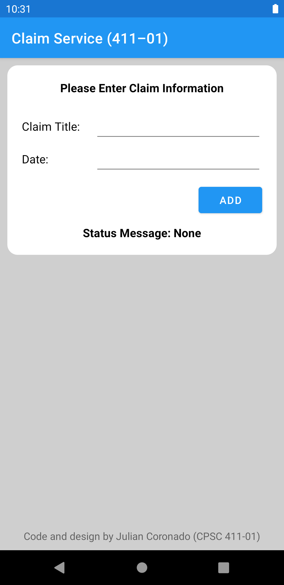
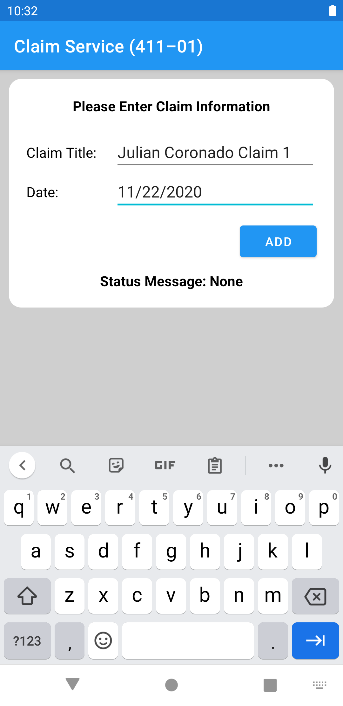
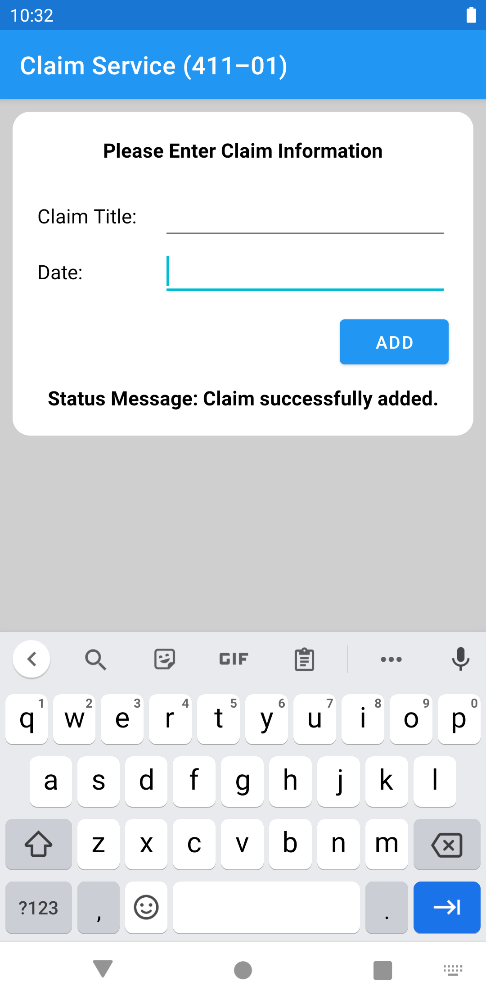

# CPSC 411-01 Homework Assignment #2
<b> by Julian Coronado </b>

<b>Goal:</b> Implement an Android UI that processes a "claim" and adds it to the local database / server from Homework #1.

<b>Tools Used:</b> Kotlin, AsyncHttp, Gson, and the Android Studio XML Editor (to create the UI)

## Preview of UI

  
  
  

